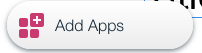
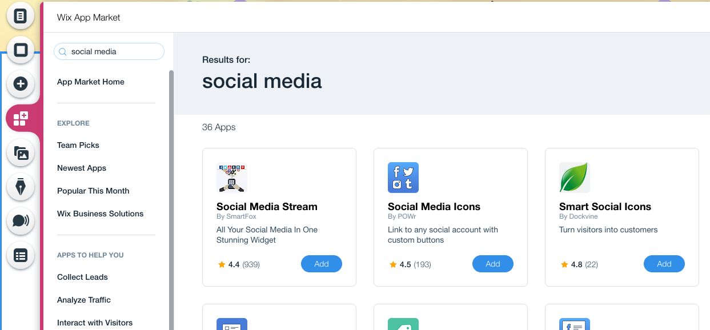
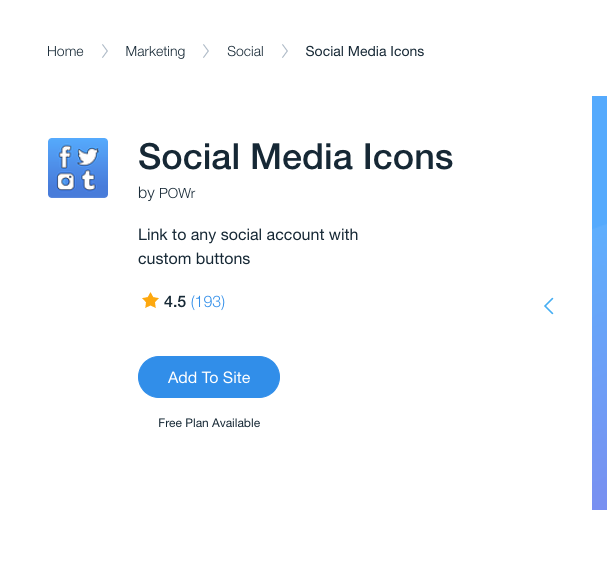
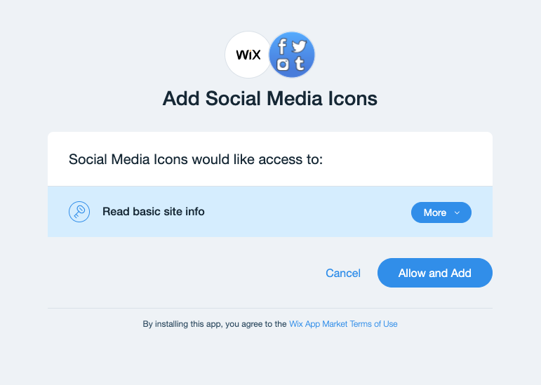

## Explore the App Market

In this module, we'll take a quick look at how you can add third party apps to you website. As a developer, you can also build and sell apps on the App Market.

**:white_check_mark: Step-by-Step Instructions**

1. Sometimes, it's easier to let someone else do all the heavy lifting for you. We'll explore how to use NPM modules and integrate with REST APIs later, but now let's look at how to add UI Widgets.

2. Click the **Add Apps** button. This will open the Wix App Market.

3. Wix and other 3rd Parties have created UI Widgets to expand the depth of functionality you can add out of the box with no coding. If you ever can't find the UI component you are looking for, this is a good place to explore.

4. Wix also enables developers to create and sell 3rd party widgets on the App Market. If you are interested, check out the [Wix App Market Developer site](https://dev.wix.com/).

5. Let's add a more **customizable social bar**. We want to include a link to our running project and the GitHub repo, so we need a more customized links bar.

6. **Search** for _Social Media_. Let's try using the **Social Media Icons** app.

7. Click **Add**. This will bring you to the App Details page. Click **Add to Site** here.

8. This will bring up a pop-up box give details about what data you are granting to the 3rd Party app. Click **Allow and Add**.

9. In the App's settings, go ahead and _delete all of the pre-added_ social links. **Add 2 new social links**: GitHub and Custom. Point the GitHub link to your **GitHub repo** and the custom link to the **publicly running app**.

10. Feel free to explore the App Market more as we build out more of the pages.

:fast_forward: Next Module => [Create a Project List page](PROJECT_REPEATER.md)
