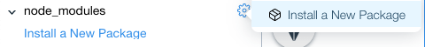
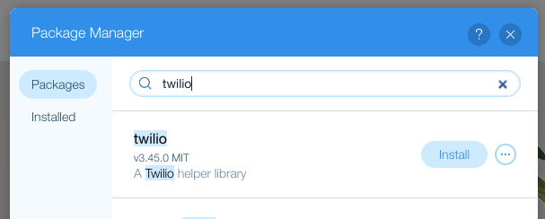

## Corvid Package Manager

In this module, we'll install NPM modules, like Twilio, to use in our application.

**:bulb: New concepts**
- [Package Manager](https://support.wix.com/en/article/corvid-managing-external-code-libraries-with-the-package-manager): Using NPM modules inside of Corvid

**:white_check_mark: Step-by-Step Instructions**

1. Corvid enables use to use our favorite tools that we may already be using in our other Node.JS projects, like NPM modules. We can easily install and manage our modules using the **node_modules** area under the Site Structure.

2. Install the **twilio** node module from the Package Manager by **clicking the gear icon** and **Install a New Package**. <br>
 <br>
 You can use the search functionality to find the Twilio package. <br>


> After the installation, you will see the new package under the node_modules section in the Site Structure panel.

3. Create a new jsw file in the Backend code and and name it **textMe.jsw**.

4. Remove template code and **import the twilio module** at the top of the file. You can import NPM modules just like you import Wix APIs.
```javascript
import twilio from 'twilio';
```

5. **Add variables for an Account SID and Auth Token** which we will get in the next module when we sign up for a Twilio account. Also **create a variable for your Twilio Phone Number**.
```javascript
const accountSID;
const authToken;
const twilioNumber;
```

5. Lasly, **stub out an async function called sendSms**. Make sure to export it as we will need to access this function on the frontend. We will fill out this function once we learn more about the Twilio API.
```javascript
export async function sendSms(messageBody) {

}
```

:exclamation: **In the next module, we will dive into creating a Twilio Account and the documentation on how to create a message.**


:fast_forward: Next Module => [Getting started with Twilio](TWILIO_START.md)    
