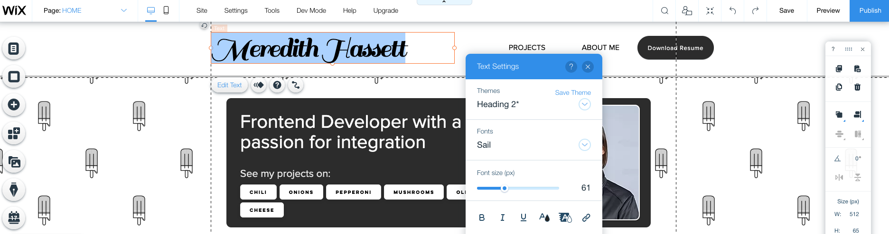
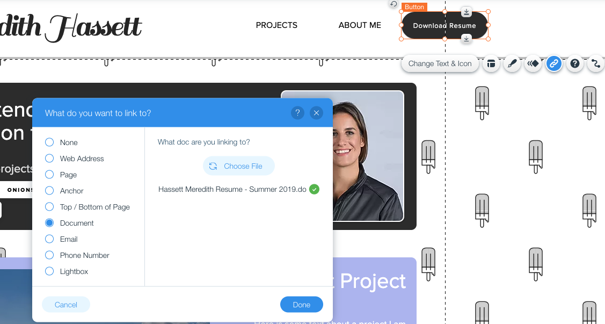
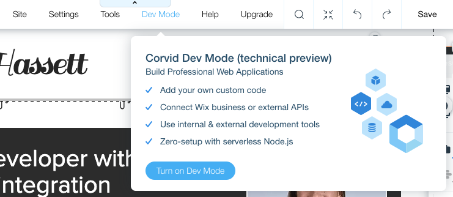
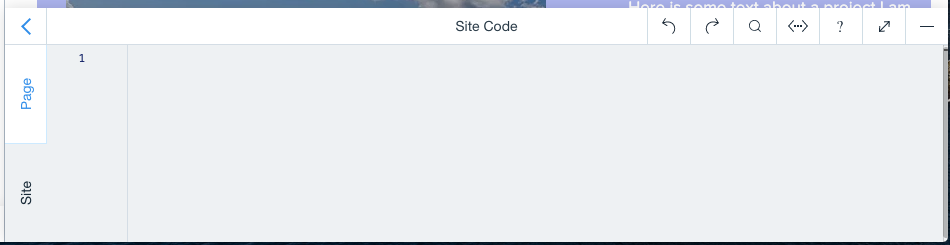
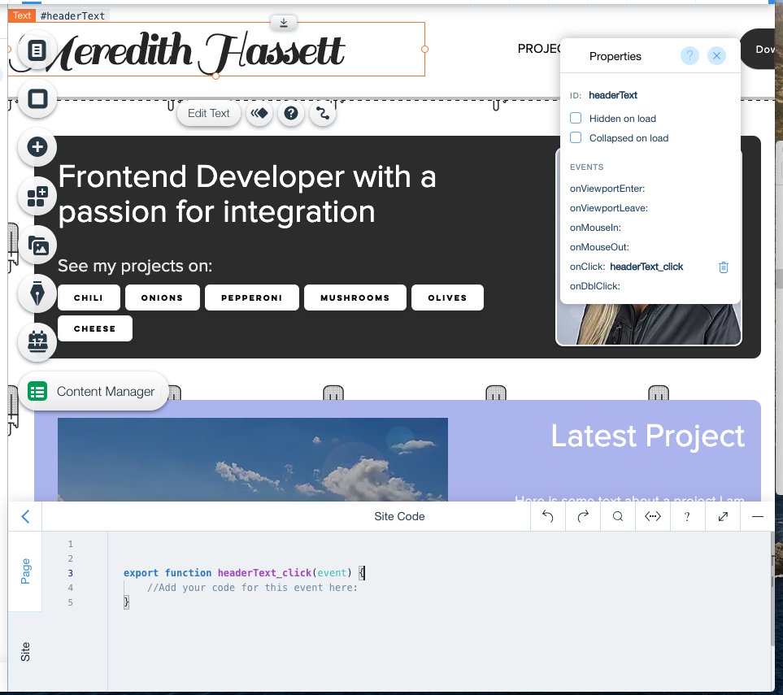

## Personalize the homepage

In this module, we'll take some time to explore Wix and customize the homepage content. We'll also enable Dev Mode and add some code.

**:bulb: New concepts**
- Getting familar with the Wix editor
- Enabling your Developer Environment
- [WixLocation](https://www.wix.com/corvid/new-reference/wix-location#top) - Functionality for navigating to pages on your site.

**:white_check_mark: Step-by-Step Instructions**

1. Once you open the template site in your editor, change the header to your name, add your byline, and add in your current favorite project you are working on.


2. Don't forgot to change the resume download link to your own!


3. Now that we've made the page our own, let's enable **Dev Mode**.

4. From the top bar menu, hover over **Dev Mode** and click **Turn on Dev Mode** to enable Corvid.


5. In the IDE on the bottom of your screen, click **Site**. We'll add some site level code that we be available on all pages in your site.


6. We can use the **`wix-location`** API to give us access to navigate the site. Start by **Importing the Wix Location API**.
```javascript
import wixLocation from 'wix-location';
```

7. We can add an `onClick` event to our header text. When you select the header text, in the **Properties Pane**, add an **`onClick`** by pressing the plus sign and hitting enter. You will now get a code stub.


8. In the empty `onClick` function, add the code to navigate to the site's home by using the `to()` method of the Wix Location API and passing in **"/"** for the base page as the parameter.
```javascript
wixLocation.to("/");
```


:fast_forward: Next Module => [Create a Database Collection for Projects](PROJECT_COLLECTION.md)
