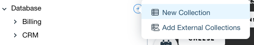
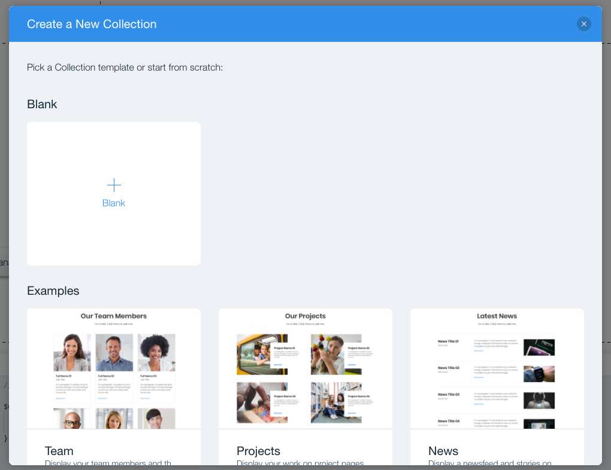
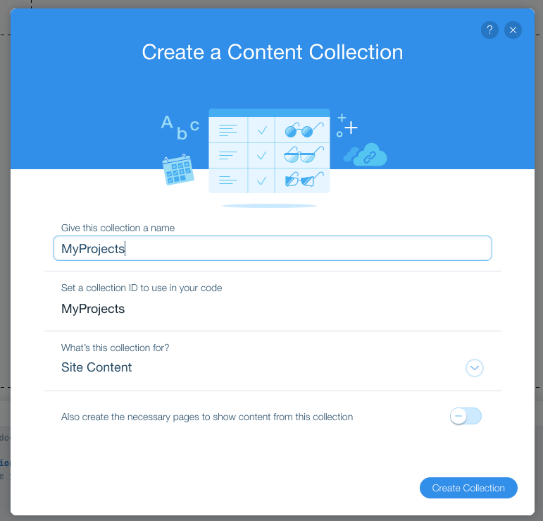
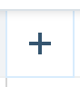
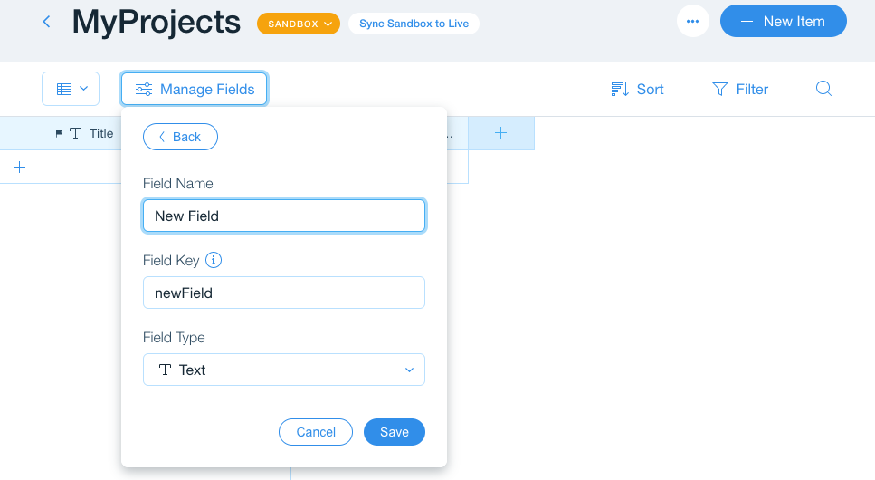

## Create a Database Collection for Projects

In this module, we'll create a database collection to store your projects list.

**:white_check_mark: Step-by-Step Instructions**

1. From the **Site Structure** sidebar on the left, under the **Database** section, click on **Add a new collection** [if you don't already have existing collections] or the **plus sign** then **New Collection** [if you already have at least 1 collection].

2. If prompted, on the Create a New Collection page, select **Blank**.

3. Name the collection **MyProjects**. *Disable the create the necessary pages check.* Click the **Create Collection** button.

4. A **Title** field will be created by default.  Add another field by clicking . Name the field **Short Description** and set the Field Type to **Text**. Click **Save**.

5. Add the following additional fields with the specified (type):
- Long Description (Text)
- Primary Language (Text)
- Technology Used (Tags)
- Screenshot (Image)
- Link to Project (URL)
- Release Date (Date and Time)

6. Add a few items to your new collection and make sure they have at least 1 Technology Used tag that does not overlap. This will be helpful for testing filtering later on.

:exclamation: **We just created a new database collection. In the next module, we'll present the data in our web application.**

:fast_forward: Next Module => [Present the Project Details on a Page](PRESENT_A_PROJECT.md)
