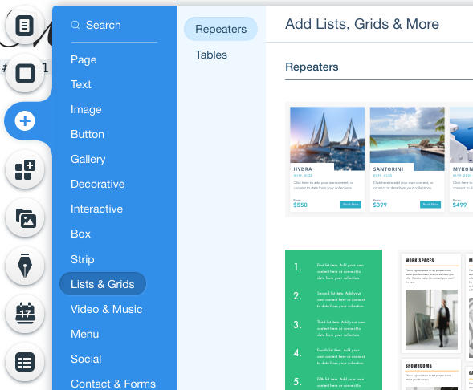

## Create a Project List page

In this module, we'll add a repeater to a page to showcase all the projects.

**:white_check_mark: Step-by-Step Instructions**

1. Go to the **MyProjects (All)** page.

2. Select the repeater on this page and **delete the repeater**.

3. Let's add a new one. Content Density is important as we want recruiters to be able to quickly skim our projects and select one. If there is too much scrolling, they won't keep looking.

4. Click **Add** and go to the **List & Grids** section.  

5. Let's select a more dense repeater. I am going to use this one:  

6. Drag and drop it on to the page.

7. We can now connect it to the Dynamic Dataset on our page. Click the **Connect to Data** icon, choose the **Projects dataset as the connector**, and **bind the appropriate database fields** to their corresponding UI elements.

:fast_forward: Next Module => [Enable Dynamic Linking](DYNAMIC_LINKS.md)
