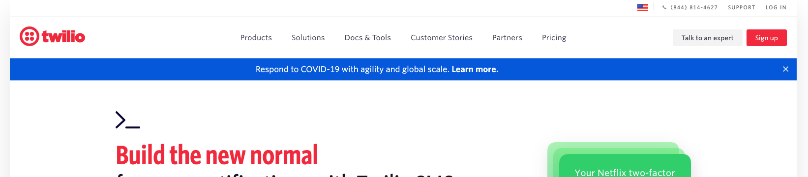
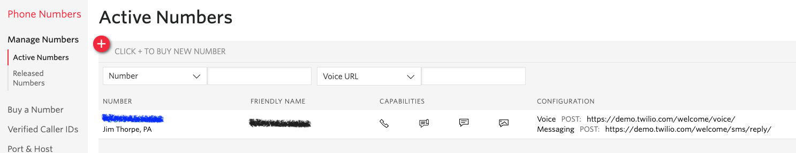
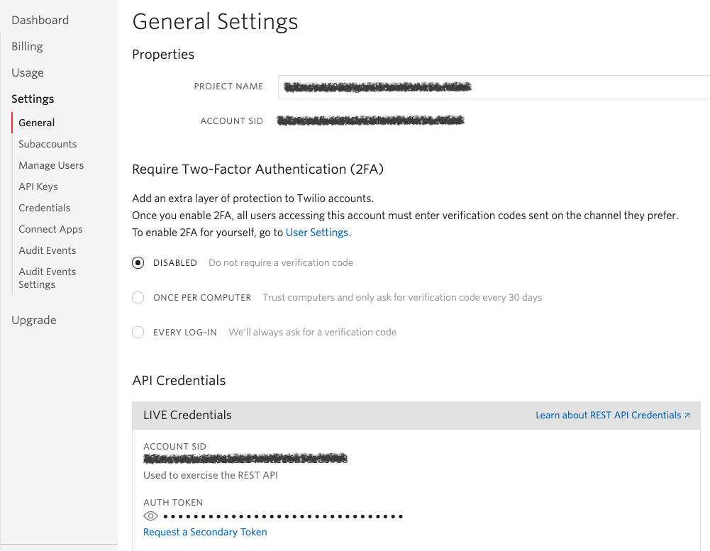

## Getting started with Twilio

In this module, we will create a Twilio Account, obtain account keys necessary for the integration, and set up our Twilio phone number.

**:bulb: New concepts**
- [Twilio Text Message API](https://www.twilio.com/docs/usage/api): Twilio's documentation on using their SMS API

**:white_check_mark: Step-by-Step Instructions**

1. You will need to either **Sign Up** for an account or **Log In** to your existing account on [Twilio](https://www.twilio.com/).  

2. You will need a **Twilio Phone Number**. This is the number that will be used to send messages from your Twilio account. Under **Phone Numbers > Manage Numbers**, make sure you have at least 1 **Active Number**.

3. You will also need your account credentials including an **Account SID** and an **Auth Token**. Under **Console Dashboard > Settings**, generate and record your Account SID and Auth Token from the **General Settings > API Credentials > LIVE Credentials** area.

4. We can now add those details to our _textMe.jsw_ file.

5. **Update the following variables with their appropriate values** that you just generated and/or recorded:
- accountSID
- authToken
- twilioNumber

:fast_forward: Next Module => [Using Twilio in Corvid](TWILIO_USAGE.md)  
